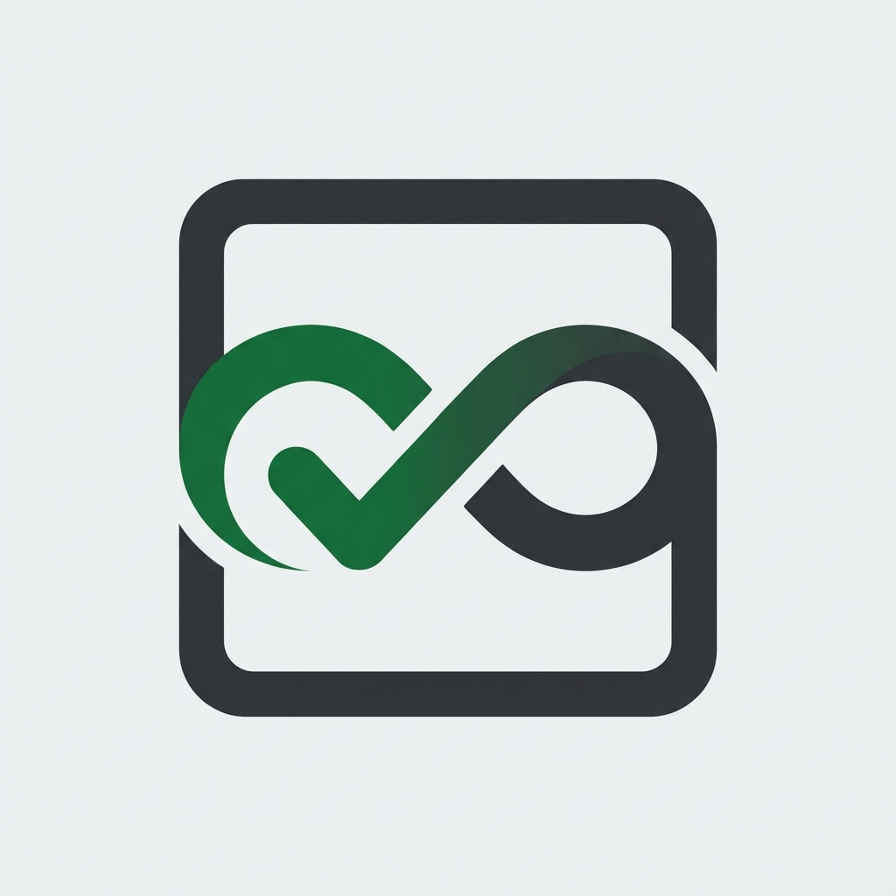

# Antigravity Auto Accept ⚡

<p align="center">
  
</p>

<p align="center">
  <strong>True Hands-Free Automation for Antigravity 2.0 & AI Coding Agents</strong><br />
  Automatically handles permission dialogs, multi-choice question prompts, "Yes, and always allow..." choices, terminal approvals, and agent actions without interruption.
</p>

<p align="center">
  <a href="https://github.com/valzevox/antigravity-auto-accept/releases"></a>
  <a href="https://github.com/valzevox/antigravity-auto-accept/blob/main/LICENSE"></a>
  <a href="https://nodejs.org"></a>
  <a href="https://github.com/valzevox/antigravity-auto-accept/stargazers"></a>
  <a href="https://github.com/valzevox/antigravity-auto-accept/issues"></a>
</p>

---

## 🌟 Why Antigravity Auto Accept?

When building large software or letting AI agents complete autonomous multi-step plans, **Antigravity 2.0** often halts and waits for user confirmation:
- File searching & reading permissions
- Command execution approvals
- Multi-choice permission modals (`1. Yes, allow this time`, `2. Yes, and always allow...`)
- Step requirement inputs and `Submit` clicks

**Antigravity Auto Accept** hooks into the Chrome DevTools Protocol (CDP) engine of Antigravity, automatically resolving and accepting these prompts in real time. Never babysit your AI agent again!

---

## ✨ Key Features

- 🎯 **Native Antigravity 2.0 Multi-Choice Support**: Intelligently handles the 5-choice permission modals, automatically selects *"Yes, and always allow in this conversation/project"*, and triggers the `Submit` button.
- 🔄 **Live Progress & Dynamic Loading Dashboard (Discord)**: Real-time progress card that updates in-place every 2.5s. Displays the agent's live thinking trace (`Thinking...`), currently executing tools (`run_command`, `view_file`...), active sub-agent counters & roles, recent auto-approvals feed, and elapsed timer without chat spam! Automatically converts into a clean completion card upon task finish.
- 🎙️ **Voice Control & Voice-to-Prompt (Groq Whisper)**: Speak naturally into Discord (voice memo or audio attachment) to query sessions, switch tabs, stop tasks, or dispatch prompts directly into Antigravity with instant transcription in ~300ms.
- 🔀 **Multi-Session Auto-Router & Seamless Background Hop**: Monitors all background conversations across your entire workspace/brain. When an agent in another session halts on a tool or permission request, the router automatically hops to that conversation, approves it, and immediately returns you back to your current active session!
- 🎮 **Two-Way Remote Interactive Buttons (Discord & Telegram)**: Whenever your AI subagents require input (`ask_question`), the bot pings you with native clickable buttons. Simply tap the option from your mobile or desktop to submit the answer directly into Antigravity!
- ⚡ **Zero-Port Discord Gateway WebSocket**: Connects directly via `wss://gateway.discord.gg`. Starts automatically with `run.bat` and remains active 24/7 without requiring public IPs, port forwarding, or ngrok tunnels.
- 🔔 **Smart Multi-Tier Notifications**: Clean Antigravity-branded embeds categorized into 4 distinct events (Manual Intervention, Task Completed, Auto-Approved, Error Logs).
- 🚀 **100% Standalone Background Daemon**: Runs silently in the background as a lightweight system service or background process without needing VS Code workbench windows.
- 🛡️ **Dangerous Command Guard**: Built-in safety filter automatically blocks hazardous patterns (`rm -rf /`, `format c:`, `dd if=`, etc.).
- 🔄 **Auto-Reconnection**: Resilient WebSocket layer detects when Antigravity opens or closes, instantly reconnecting within 3 seconds.

---

## 📦 Architecture Overview

```
                      +-----------------------------+
                      |       Antigravity 2.0       |
                      |  (--remote-debugging-port)  |
                      +--------------+--------------+
                                     ^
                                     | WebSocket / CDP (:9000)
                                     v
+-------------------------------------------------------------------+
|               Antigravity Auto Accept Daemon                      |
|                                                                   |
|   +-----------------------+           +-----------------------+   |
|   |   CDP Target Hunter   |  ------>  |  Script DOM Injector  |   |
|   +-----------------------+           +-----------+-----------+   |
|               |                                   |               |
|               v                                   v               |
|   +-----------------------+         +-------------------------+   |
|   |  MultiSessionRouter   |         |    auto-accept.js DOM   |   |
|   |  - Disk Brain Watcher |         |  - Select Permission    |   |
|   |  - Auto-Hop & Return  | <=====> |  - Click Submit         |   |
|   +-----------------------+         |  - Auto-Resume Agent    |   |
|                                     +-------------------------+   |
+-------------------------------------------------------------------+
```

---

## 🚀 Quick Start Guide

> ⚡ **Cài đặt 1 dòng lệnh duy nhất (giống Free Claude Code):**  
> Toàn bộ quá trình cài đặt, vá cổng 9000, nhập credentials, và đăng ký tự khởi động khi reset máy được gói gọn trong một script PowerShell duy nhất!

### Cách 1: Cài đặt trực tiếp qua PowerShell (Khuyên dùng)

Mở PowerShell trên máy tính của bạn và dán lệnh sau:

```powershell
& ([scriptblock]::Create((irm "https://raw.githubusercontent.com/valzevox/antigravity-auto-accept/main/scripts/install.ps1")))
```

---

### Cách 2: Clone repository & chạy installer

```bash
git clone https://github.com/valzevox/antigravity-auto-accept.git
cd antigravity-auto-accept
powershell -ExecutionPolicy Bypass -File scripts\install.ps1
```

---

### 🛠️ Script Installer (`install.ps1`) sẽ tự động làm gì?

1. ✅ **Kiểm tra môi trường:** Tự động phát hiện Node.js (>= 18.x) và Git.
2. ✅ **Cài đặt thư viện:** Chạy `npm install --omit=dev` sạch sẽ.
3. ✅ **Tự động cấu hình cổng (Port 9000):** Tự quét toàn bộ Desktop và Start Menu để thêm cờ `--remote-debugging-port=9000` vào shortcut Antigravity.
4. ✅ **Trình nhập Credentials tương tác:** Cho phép bạn dán ngay Discord Bot Token, Channel ID, Owner ID, Groq API Key vào cửa sổ console (nhấn Enter để bỏ qua nếu chưa có).
5. ✅ **Đăng ký tự khởi động (Windows Task Scheduler):** Đăng ký tác vụ hệ thống `AntigravityAutoAccept` kích hoạt khi bạn đăng nhập Windows (`-AtLogOn`).
6. ✅ **Kích hoạt ngay:** Khởi chạy daemon lập tức.

---

### 🔄 Cơ chế tự động khi khởi động lại máy tính (Reboot)

Khi máy tính của bạn khởi động lại:
- Task Scheduler sẽ tự động chạy: **`update.bat` ➔ `run.bat`**.
- **`update.bat`**: Kiểm tra GitHub xem bạn có commit mới không, nếu có thì tự kéo về (`git pull`) và cài thêm gói (`npm install`) trong 1-2 giây.
- **`run.bat`**: Khởi động daemon phục vụ bạn ngay lập tức.
- Bạn **KHÔNG** cần phải chạy lại `install.ps1` hay thao tác gì thêm!

---

### 📋 Command Reference

Ở thư mục gốc dự án chỉ giữ lại các file thiết yếu:

| Command | Mô tả |
| :--- | :--- |
| `run.bat` | Khởi chạy daemon với cửa sổ Console trực quan (tương thích Windows 10 & 11) |
| `update.bat` | Kiểm tra cập nhật GitHub thủ công ngay lập tức |
| `status.bat` | Kiểm tra xem daemon có đang chạy và CDP port 9000 có hoạt động không |
| `powershell -File scripts\install.ps1` | Chạy lại trình cài đặt hoặc cập nhật credentials bất cứ lúc nào |

---

### Step 3: Hướng dẫn cấu hình chi tiết (Discord & Telegram)

Mở file **`config.json`** (được tạo tự động ở Bước 2) và điền thông tin của bạn:

```json
{
  "webhooks": {
    "discord": "https://discord.com/api/webhooks/YOUR_WEBHOOK_URL",
    "discordBot": {
      "token": "YOUR_DISCORD_BOT_TOKEN",
      "channelId": "YOUR_CHANNEL_ID",
      "guildId": "YOUR_GUILD_ID",
      "ownerUserId": "YOUR_DISCORD_USER_ID",
      "mentionUserId": "YOUR_DISCORD_USER_ID"
    },
    "telegram": {
      "botToken": "YOUR_TELEGRAM_BOT_TOKEN",
      "chatId": "YOUR_CHAT_ID"
    },
    "customUrl": ""
  },
  "groqApiKey": "YOUR_GROQ_API_KEY",
  "events": {
    "onManualIntervention": true,
    "onTaskCompleted": true,
    "onAutoApproved": true,
    "onError": true
  }
}
```

> 💡 **Không muốn dùng kênh nào?** Có thể để trống/`""`. Bot sẽ tự bỏ qua kênh đó (ví dụ: chỉ dùng Discord thì bỏ trống `telegram.botToken` và `telegram.chatId`).

---

### Step 3.1: 🤖 Cấu hình Discord Bot (khuyên dùng)

Để điều khiển Antigravity 2 chiều từ Discord (gửi prompt, nghe voice, nhận thông báo, bấm nút trả lời):

1. **Tạo Discord Application & Bot**:
   - Vào [Discord Developer Portal](https://discord.com/developers/applications) → **New Application** → đặt tên → **Create**.
   - Chuyển sang tab **Bot** → **Reset Token** → **Copy** → dán vào `discordBot.token` trong `config.json`.
2. **Bật quyền cho Bot** (trong tab **Bot** → *Privileged Gateway Intents*):
   - ✅ **Message Content Intent** (BẮT BUỘC — để bot đọc được nội dung lệnh `!prompt`).
3. **Mời Bot vào server** (tab **OAuth2** → **URL Generator**):
   - Scopes: ✅ `bot`
   - Bot Permissions: ✅ `Send Messages`, ✅ `Read Message History`, ✅ `Embed Links`, ✅ `Attach Files`, ✅ `Add Reactions`.
   - Copy URL được tạo → mở trên trình duyệt → chọn server của bạn → **Authorize**.
4. **Lấy các ID cần thiết**:
   - Bật **Developer Mode** trong Discord: *User Settings → Advanced → Developer Mode*.
   - **Channel ID** (`channelId` + `!setchannel`): Chuột phải vào kênh muốn dùng → **Copy Channel ID**.
   - **Guild ID** (*không bắt buộc*): Chuột phải vào server → **Copy Server ID**.
   - **Owner User ID** (`ownerUserId` + `mentionUserId`): Chuột phải vào avatar của bạn → **Copy User ID**.
     > 🔒 `ownerUserId` là ID chủ sở hữu — chỉ tài khoản này mới chạy được các lệnh điều khiển và voice. Người khác trong server gõ lệnh sẽ bị từ chối!
5. **(Khuyên dùng) Lấy Webhook URL** (`discord` — cho thông báo embed đẹp có nút bấm):
   - Chuột phải vào kênh → **Edit Channel** → **Integrations** → **Webhooks** → **New Webhook** → **Copy Webhook URL** → dán vào `discord`.
6. **(Tùy chọn) Groq API Key** (`groqApiKey` — bật nhận diện giọng nói):
   - Vào [console.groq.com/keys](https://console.groq.com/keys) → **Create API Key** → copy → dán vào `groqApiKey`.
   - Hoặc set trực tiếp trong Discord bằng lệnh: `!setgroq gsk_...`

---

### Step 3.2: 📨 Cấu hình Telegram Bot (tùy chọn)

Để nhận thông báo và bấm nút trả lời trực tiếp trên Telegram:

1. **Tạo Bot qua BotFather**:
   - Mở Telegram → tìm **@BotFather** → gửi `/newbot` → đặt tên & username cho bot.
   - BotFather trả về **HTTP API Token** (dạng `123456:ABC-DEF...`) → dán vào `telegram.botToken`.
2. **Lấy Chat ID**:
   - **Cách A**: Nhắn bất kỳ tin gì cho bot của bạn, sau đó mở trình duyệt truy cập:
     `https://api.telegram.org/bot<BOT_TOKEN>/getUpdates`
     → tìm giá trị `"chat":{"id":...}` → đó là Chat ID → dán vào `telegram.chatId`.
   - **Cách B**: Dùng bot [@userinfobot](https://t.me/userinfobot) → nó trả về `Id` của bạn.
   - **Cách C (Nhóm)**: Thêm bot vào nhóm → lấy Chat ID nhóm (thường bắt đầu bằng dấu `-`).
3. Dán `telegram.botToken` và `telegram.chatId` vào `config.json`.

---

### Step 4: Khởi động lại & Test

1. Chạy lại daemon để nạp cấu hình mới: **nhấn đúp [`run.bat`](run.bat)** (hoặc [`run-win11.bat`](run-win11.bat) để xem log trực tiếp trên Windows 11).
2. **Khởi động lại Antigravity** bằng shortcut đã được patch (bước setup).
3. Test trên Discord/Telegram bằng lệnh:
   - `!status` → kiểm tra kết nối CDP & session hiện tại.
   - `!prompt hello world` → gửi thử 1 prompt vào Antigravity.
   - Gửi 1 tin nhắn voice note → kiểm tra nhận diện giọng nói (nếu đã bật Groq).

> ✅ **Xong!** Từ giờ hệ thống sẽ **tự động cập nhật code** mỗi khi khởi động máy và **tự chạy daemon** ngầm — bạn không cần thao tác gì thêm.

---

### 🔄 Cập nhật phiên bản mới

Bạn **không cần làm gì cả**! Mỗi lần khởi động lại máy, daemon tự động so sánh commit với GitHub và kéo bản mới nhất về.

Muốn cập nhật thủ công ngay lập tức: **nhấn đúp [`update.bat`](update.bat)**.

---

### Manual Alternative (Advanced Users)

```bash
# Install dependencies
npm install

# Patch Antigravity shortcuts
powershell -ExecutionPolicy Bypass -File scripts\update-shortcuts.ps1

# Start the background daemon
run.bat
```

---

## 📋 Command Reference

| Command | Description |
| :--- | :--- |
| `setup.bat` | Full 1-click setup: install, patch shortcuts, register startup, run daemon |
| `update.bat` | 🔄 **1-Click Auto-Updater**: Checks remote GitHub commits, pulls changes, updates packages, and restarts daemon |
| `run.bat` | Start or restart the background daemon (auto-checks for GitHub updates on startup) |
| `run-win11.bat` | **Windows 11**: Start or restart with a **visible popup Console window** + auto-updates on startup |
| `status.bat` | Check if the daemon is running and CDP is connected |
| `node daemon.js` | Run daemon in foreground (for debugging) |
| `node test-multi-session.js` | Run self-test for Multi-Session Auto-Router detection |
| `node test-notifier.js` | Run self-test for Discord & Telegram Webhook notifications |

> 💡 **Tự động cập nhật khi khởi động máy (Boot Auto-Update)**: Mỗi khi bạn khởi động lại máy tính (Windows Startup / Reboot), hệ thống sẽ tự động so sánh commit với GitHub, kéo bản mới nhất về (`git pull`) và cập nhật dependencies rồi mới khởi chạy daemon. Không cần phải mở PowerShell hay thao tác thủ công!

---

## 🔔 Webhook Notifications & Remote Action Buttons (Discord & Telegram)

Get alerted on Discord or Telegram whenever your AI subagents require attention, styled with native **Antigravity branding** (custom avatar, signature footer, and event color-coding):

### Event Types:
- 1️⃣ **Case 1 (Manual Intervention Required)**:
  - Subagent asks an interactive question (`ask_question`).
  - **Discord**: Automatically pings your user tag (`@username`) and attaches native **Clickable Action Buttons** (Options 1, 2, 3...) directly under the embed.
  - **Telegram**: Attaches native **Inline Keyboard Buttons**.
  - **Remote Action**: Tap any button on your phone or PC → Antigravity automatically hops to the session, selects your answer, and clicks `Submit`!
- 2️⃣ **Case 2 (Task Completed)**: Subagent finishes its execution turn without further tool calls. Clean embed notification with no noisy pings.
- 3️⃣ **Case 3 (Auto-Approved)**: Daemon auto-detects and accepts permissions in background sessions (`⚡ Auto-Approved`). Quiet notification without user mention.
- 4️⃣ **Case 4 (Execution Error)**: Detailed error reports with runtime stack traces for troubleshooting.

---

### Configuration:

Chi tiết cách lấy Token và cấu hình `config.json` xem tại [Step 3: Cấu hình Discord & Telegram](#step-3-điền-thông-tin-discord--telegram-vào-configjson).

---

---

### Remote Two-Way Discord Controller:

Manage Antigravity directly from Discord — both receive notifications AND send prompts back into the IDE:

| Command | Description | Example |
|---|---|---|
| `!prompt <text>` | **Send a prompt directly into Antigravity** and execute it | `!prompt fix the bug in index.js` |
| `!message <text>` | Alias of `!prompt` | `!message build a login page` |
| `!ask <text>` | Alias of `!prompt` | `!ask summarize this repo` |
| `!new <text>` | Open a fresh Antigravity session, then send the prompt | `!new refactor auth module` |
| `!stop` | Emergency stop the currently running task | `!stop` |
| `!sessions` | **List open sessions & highlights active session** | `!sessions` |
| `!switch <id \| name>` | **Switch Antigravity to another session by ID or name** | `!switch 89e10449` / `!switch Higgsfield` |
| `!setgroq <key>` | **Set Groq API key for Speech-to-Text voice transcription** | `!setgroq gsk_...` |
| `!status` | Check Antigravity CDP connection & active session | `!status` |
| `!config` | View active notification channel & ping settings | `!config` |
| `!setchannel <#channel \| id>` | Change notification & prompt channel live | `!setchannel #agent-logs` |
| `!setping <target>` | Change ping target on prompts & task completion | `!setping here` / `!setping @valzevox` / `!setping off` |
| `!channels` | List server text channels with IDs for easy selection | `!channels` |
| `!setvoice <on\|off>` | Bật hoặc tắt tính năng nhận diện giọng nói (Voice Control) | `!setvoice off` |
| `!help` | Show command help in an interactive embed | `!help` |

> **🛡️ Channel Isolation (Cách ly kênh bảo mật):**
> Bot **chỉ lắng nghe và xử lý tin nhắn / voice note trong đúng Channel ID** được cấu hình trong `config.json` (hoặc đặt qua `!setchannel`). Tất cả tin nhắn, tập tin audio, hay voice note ở các kênh khác trong server đều được bỏ qua 100%, chống trigger nhầm!

> **🎙️ Voice-to-Prompt & Voice Control:**
> Gửi file âm thanh hoặc nhấn giữ ghi âm trực tiếp trên Discord vào đúng kênh của bot!
> - Nếu bạn không muốn nhận diện voice, có thể gõ `!setvoice off` để tắt bất cứ lúc nào!
> - Khi bật (`!setvoice on`):
>   1. Chuyển đổi âm thanh tự động và nhận diện qua Groq Whisper (`whisper-large-v3-turbo`) siêu tốc (~300ms).
>   2. **Phân tích khẩu lệnh (Voice Commands):**
>      - *"Danh sách session"* / *"Xem các phiên"* ➡️ Tự động liệt kê các sessions đang mở.
>      - *"Chuyển sang session <tên hoặc ID>"* ➡️ Tự động chuyển tab Antigravity sang phiên đó.
>      - *"Dừng lại"* / *"Hủy task"* ➡️ Dừng tác vụ đang chạy.
>      - *"Trạng thái"* / *"Status"* ➡️ Kiểm tra tình trạng kết nối.
>      - *"Phiên mới: <prompt>"* ➡️ Mở phiên làm việc mới và nạp prompt.
>      - *Mọi câu nói thông thường khác* ➡️ Tự động nạp thành Prompt vào phiên hiện tại và nhấn Enter!

> **Note:** `!prompt` requires Antigravity to be open on this machine. If the IDE is closed the bot replies with a clear error so you know nothing was lost.

> 🔗 **Hướng dẫn tạo Bot & lấy Token/ID:** Xem chi tiết tại [Step 3.1: Cấu hình Discord Bot](#step-31--cấu-hình-discord-bot-khuyên-dùng).

---

## 🔍 Diagnostics &amp; Health Check

Check the live status of the auto-accept engine at any time by double-clicking **`status.bat`**:

```powershell
powershell -ExecutionPolicy Bypass -File status.ps1
```

Example Output:
```text
RUNNING PID=22888
--- last 3 log lines ---
[AutoAccept] [CDP] Script injected into 9000:DDB37C2BA90087861A99D944E41AAC30
[AutoAccept Daemon] Successfully connected to Antigravity 2.0 via CDP!
--- CDP port 9000 ---
CDP OK (200)
```

---

## ⚙️ Configuration

Custom settings can be adjusted in `main_scripts/cdp-handler.js` or through environment configurations:

| Option | Default | Description |
| :--- | :--- | :--- |
| `cdpPort` | `9000` | Port for Chrome DevTools Protocol WebSocket. |
| `pollInterval` | `500ms` | Frequency of DOM scans for pending modal inputs. |
| `isBackgroundMode`| `true` | Allows continuous approvals when window is unfocused. |

---

## 🛡️ Safety & Command Blacklist

The auto-accept engine protects your machine by refusing to auto-click approvals containing destructive patterns:
- `rm -rf /` / `rm -rf ~` / `rm -rf *`
- `format c:` / `del /f /s /q`
- `mkfs.*` / `> /dev/sda`
- Fork bombs and destructive system calls

---

## 🤝 Contributing

Contributions, issues, and feature requests are welcome!
Feel free to check the [Issues page](https://github.com/valzevox/antigravity-auto-accept/issues).

1. Fork the Project
2. Create your Feature Branch (`git checkout -b feature/AmazingFeature`)
3. Commit your Changes (`git commit -m 'feat: add amazing feature'`)
4. Push to the Branch (`git push origin feature/AmazingFeature`)
5. Open a Pull Request

---

## 💖 Support & Donate

If **Antigravity Auto Accept** saved your time and made your workflow seamless, consider buying me a coffee or supporting my work:

<p align="left">
  <a href="https://ko-fi.com/m1n698"></a>
  &nbsp;&nbsp;
  <a href="https://zypage.com/m1n6"></a>
</p>

- **Ko-fi:** [ko-fi.com/m1n698](https://ko-fi.com/m1n698)
- **ZyPage:** [zypage.com/m1n6](https://zypage.com/m1n6)

---

## 👤 Author

**valzevox**
- GitHub: [@valzevox](https://github.com/valzevox)
- Email: [valzevox@gmail.com](mailto:valzevox@gmail.com)

---

## 📄 License

This project is licensed under the MIT License - see the [LICENSE](LICENSE) file for details.
